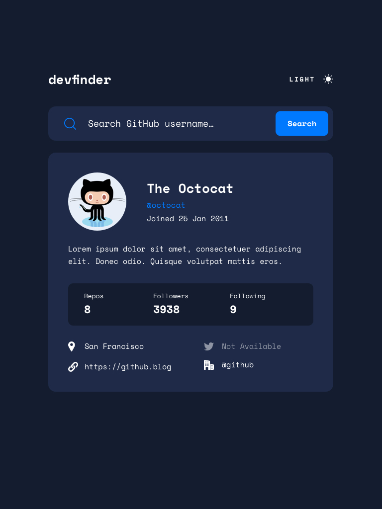

# Versión 0.0.0
Características principales:

- Plantilla (Template): Se ha establecido la estructura base del proyecto, creando un diseño o plantilla que servirá de base para futuras funcionalidades.

- Aplicación operativa (now working): El proyecto ahora es funcional en su forma más básica. Esto implica que los elementos principales están en su lugar y se pueden visualizar o interactuar con ellos.

- Cargador (Loader) añadido: Se ha implementado un cargador que aparece cuando se está cargando información o al realizar una solicitud, mejorando la experiencia del usuario al saber que algo está en proceso.

- Archivo de API falso (apifake.json): Se ha agregado un archivo JSON simulado que actúa como una API falsa para proporcionar datos ficticios. Estos datos se cargan en una tarjeta u otro componente, lo que permite simular cómo se comportaría la aplicación con datos reales.
nota: cargara por defecto la api fake y despues se cargara la informacion del user que ingreses

- Rutas (routes):encaso de usar otras rutas a la principal mostrara mensaje de error 404

# preview

